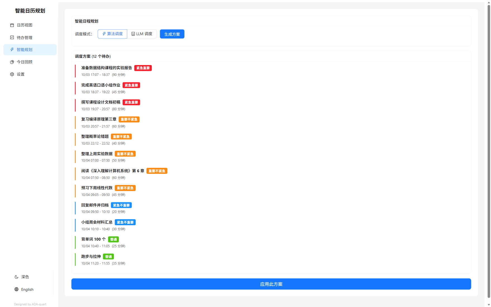
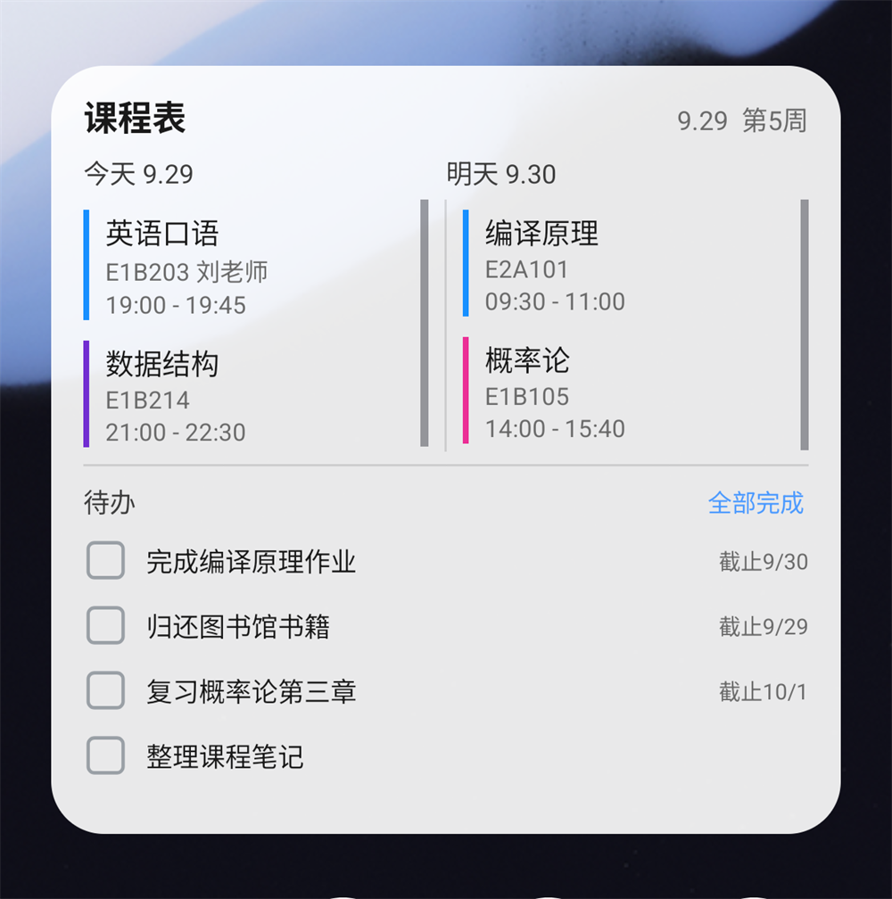
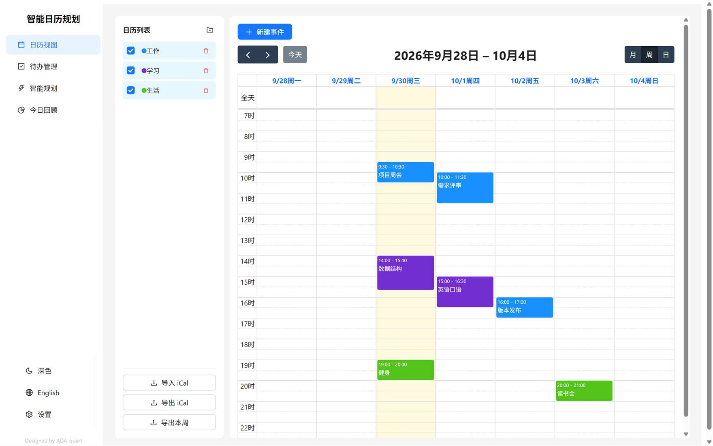
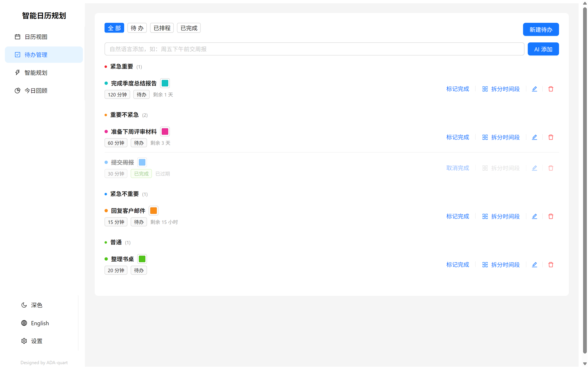
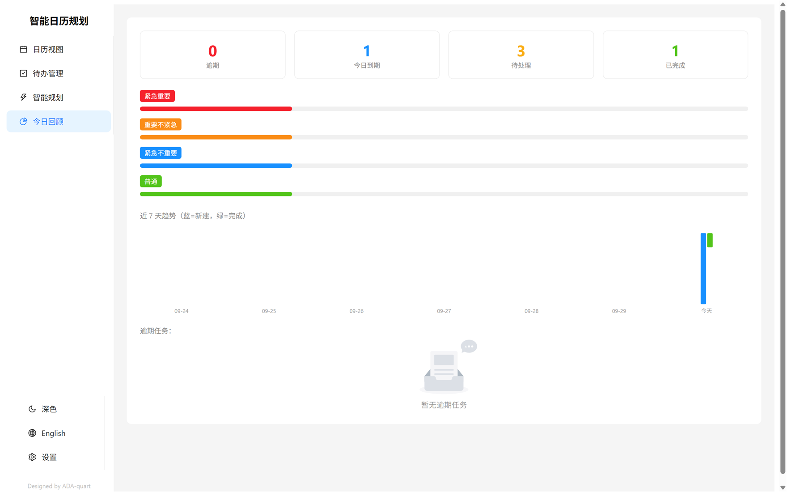

<div align="center">


<h1>ITDC</h1>

<p><b>Local-first smart todos, timetable and calendar</b><br>
Let an algorithm or an LLM slot your todos into the gaps; import your university timetable in one go — reminders and the home-screen widget all run on-device<br>
Make it yours: drop in your own photo and the calendar and widget turn translucent or frosted</p>

<p>
  <a href="https://github.com/ADA-quart/ITDC/releases/latest"><b>Download Android APK</b></a> ·
  <a href="README.md">简体中文</a> ·
  <a href="docs/ARCHITECTURE.md">Architecture</a> ·
  <a href="CHANGELOG.md">Changelog</a>
</p>

<p>
  <a href="https://github.com/ADA-quart/ITDC/actions/workflows/ci.yml"></a>
  <a href="https://github.com/ADA-quart/ITDC/releases/latest"></a>
  
  <a href="LICENSE"></a>
</p>



</div>

ITDC is a scheduler built **for personal use**: calendar, Eisenhower-matrix todos, AI/algorithmic scheduling, a daily review, university timetable import, reminders and an Android home-screen widget.
It runs **on your device by default** — no account, no upload, and every feature works without a server. Add a self-hosted sync server only when you need multiple devices.

What it is not: not team collaboration, not SaaS, and it will not ship your timetable or todos to somebody else's server.

---

## Features

| Area | What it does |
|------|--------------|
| 🧠 **Scheduling** | Algorithmic or LLM scheduling that fills calendar gaps by priority and deadline, then validates the result |
| 📅 **Calendar** | Multiple calendars with their own colours, RRULE recurrence, drag to reschedule, drag the edge to resize, swipe to page, day/week views |
| ✅ **Todos** | Eisenhower P1–P4 auto-grading, long-task splitting, countdown and overdue highlighting, natural-language input |
| 🎓 **Timetable import** | Sign in to the university system through CAS and import a whole semester as a calendar; one fixed colour per course |
| ⏰ **Reminders** | On-device Android notifications: todo due reminders and pre-class reminders (configurable lead time, optional silent channel) |
| 📱 **Home-screen widget** | Today/tomorrow classes plus a scrollable todo list, room · teacher subtitles, tap anywhere to open the app (only the checkbox ticks) |
| 📊 **Daily review** | Overdue / due today / pending / done counts with a 7-day trend |
| 📥 **Import & export** | iCal import/export and weekly Excel export (the phone shares the file through the system share sheet) |
| 🎨 **Personalisation** | **Custom background photo + avatar-style crop (draggable focus, 1-3x zoom)**, glass UI, calendar opacity and blur sliders, accent colour, light / dark / follow-system, independent widget appearance |
| 📴 **Offline** | Reads and writes work offline; with sync enabled, devices merge by `sync_uid` when online |

## Scheduling

Press “Generate plan”: the engine reads every open todo plus your existing events, avoids busy slots and lays out a plan by priority. Confirm it and the plan lands in your calendar, where you can still drag things around.

| Mode | How it plans | Best for |
|------|--------------|----------|
| ⚡ Algorithmic | Deterministic, on-device, instant | Predictable, reproducible plans |
| 🧠 LLM | Lets a model read the intent of each task | Vague or complex task descriptions |

The algorithmic mode sorts by priority quadrant, then by deadline, works only inside 07:00–23:00, avoids existing events and already-scheduled todos, and caps each block at 90 minutes. After two hours of continuous work it leaves a 15-minute gap before the next block (a natural gap of 15+ minutes counts as rest already taken). Afterwards it validates conflicts, out-of-hours blocks, deadlines and past times — problems are listed instead of silently written.

The LLM mode **works without any server too**: the app builds the prompt itself and calls the provider directly. OpenAI, DeepSeek, Ollama, LM Studio and any OpenAI-compatible endpoint are supported, and the prompt template is editable. API keys are encrypted with the **Android Keystore** (the browser build falls back to local plaintext and says so in Settings).

## University timetable import (CDUT)

1. Settings → General → **School** → Chengdu University of Technology (school definitions live in [`shared/schools.ts`](shared/schools.ts) — add new schools there)
2. Calendar sidebar → **Import academic timetable** → sign in with your CAS credentials
3. Pick the semester, enter the Monday of week 1 → import

The result is a separate calendar where **every course has its own colour** (the same course always gets the same one), and each event carries teacher, weeks and period in its notes.
Tick “Remember me” and the next import signs in automatically using credentials from the system keystore.

> The native app talks to the university CAS and academic system directly — no relay server. Parsing lives in [`shared/cdut-parser.ts`](shared/cdut-parser.ts) and handles real-world quirks such as “several courses stacked in one cell” and “multiple week ranges per course”.

## Reminders

- **Todo reminders**: on-device notification at the scheduled start or the deadline.
- **Class reminders**: for imported timetables, a notification with course, start time, room and teacher, 5–30 minutes ahead.
- **Silent mode**: ringing and silent are two separate notification channels; the silent one only appears in the shade without sound or vibration, and you can also tune just that channel in system settings.

All reminders are scheduled on the device, need no server, and are re-queued automatically when your timetable changes.

## Home-screen widget

<p align="center">
  
</p>

- 🗓️ Today / tomorrow columns with course colours, room and time; finished classes fade out on their own
- ☑️ Scrollable todo list, tick the checkbox to complete, finished items get a strike-through and sink to the bottom
- 👆 Tapping anywhere opens the app on the calendar page
- 🎨 Panel colour, opacity, light/dark and background image are configurable inside the app

## Personalisation

Beyond light / dark, you can put your own photo behind the UI: cards turn translucent + frosted so the photo shows through, while course and todo blocks keep their solid colours.

<p align="center">
  
</p>

### Background photo and avatar-style crop

- Pick a photo from the gallery; it sits at the very bottom layer, while the calendar cards, timetable cells, calendar list and bottom navigation turn **translucent + frosted** so the photo shows through. Course and todo blocks keep their solid colours
- The photo scales **proportionally between 1x and 3x**; the visible area is chosen by a **focus point** you can drag directly on the preview or nudge with the horizontal / vertical sliders
- The frame is fixed and always filled — **no stretching and no letterboxing**. The same crop model is used by the app and the home-screen widget, so both show the same picture

### Calendar opacity and blur

| Slider | Effect |
|--------|--------|
| Calendar opacity | 0 = fully transparent, no frosting (the photo shows straight through); 100 = solid card |
| Calendar blur | 0 = no frosted glass at all; higher values blur the background more |

Course and todo blocks always stay solid — only the card base takes part in opacity and blur, so a busy photo never hurts readability.

### Theme and typography

- **Light / dark / follow system**, applied immediately (including system switches)
- **Accent colour** used by buttons, selected states and the widget accent
- Type scale and line heights follow Material 3 and Apple HIG (body 14/22, emphasis 16/24, labels 11-12), with the device CJK UI font stack, and tabular figures for times and dates
- Contrast is calibrated to WCAG AA (secondary text in light mode is `#666`, 5.7:1)

### Widget appearance

The widget keeps its own appearance, independent from the app:

- Panel colour, opacity, scheme (follow system / force light / force dark)
- The background photo is pre-cropped at the chosen focus and zoom, then handed to the launcher as a high-resolution file
- Optional "week N only" header, and course subtitles show **room · teacher** (e.g. `E1B205 · 李军`)
- List scrollbars fade out when idle

### Reset

"Reset widget appearance" only touches widget colours, opacity, scheme and the background switch (accent colour and photo stay); the footer button resets everything and clears the uploaded photo.

## Screenshots

<p align="center">
  
  
  
</p>

> **Tap** a class or todo to see its details (time, room, calendar, teacher and weeks…), **long-press** to delete; drag events to reschedule and swipe to change days.

## Quick start

**Android**: download the APK from [Releases](https://github.com/ADA-quart/ITDC/releases/latest) (debug-signed — fine for personal use, not for app stores).

**Web / desktop**

```bash
git clone https://github.com/ADA-quart/ITDC.git
cd ITDC
npm install
npm run dev          # http://localhost:5173
```

That is the “this device only” mode — everything works with no configuration.

**Windows**: run `install.bat`, then `start.bat` (it prints your LAN IP for connecting your phone).

**Docker**

```bash
docker compose up -d
```

## Three ways to run it

| Mode | Scenario | Setup |
|------|----------|-------|
| This device only (default) | Single device | Nothing to configure; data lives in IndexedDB / app storage, scheduling and LLM calls happen locally |
| LAN | Phone + computer | Run `npm start` on the computer, enter `http://<PC-IP>:3000/api` in the app's settings |
| Public | Multi-device anywhere | Deploy to a server or tunnel, then enter `https://<domain>/api` |

Switching to sync **merges** both sides: records that exist on only one side are kept, and for the same record the newer `updated_at` wins.

> ⚠️ The server has no authentication — anyone who can reach the URL can read and write. Add access control before exposing it publicly; see [SECURITY.md](SECURITY.md).

## Tech stack

React 18 · TypeScript · Ant Design 5 · FullCalendar 6 · Vite 6 · IndexedDB
· Express · sql.js (SQLite compiled to WASM, no native build) · Capacitor 8 · Vitest

## Repository layout

```text
src/                    Frontend: calendar, todos, scheduling, review, settings, i18n
  api/                  Local data layer, optional sync, CAS timetable client, notification scheduling
shared/                 Shared by client and server: timetable parser, school config, course colours, prompts
server/                 Optional sync server: Express + sql.js (routes / db / scheduler / LLM proxy)
plugins/itdc-widget/    Android home-screen widget (local Capacitor plugin with native layouts and receivers)
android/                Capacitor Android shell and packaging config
docs/                   Architecture, deployment, widget and API docs plus screenshots
```

## Development

```bash
npm run dev:all      # frontend 5173 + optional backend 3000
npx tsc --noEmit     # type check
npm run test         # unit tests (Vitest)
npm run build        # build the frontend
```

Building the Android APK (the order matters — running gradle alone will not repackage the web assets):

```bash
npm run android:sync
cd android && ./gradlew assembleDebug
```

When you touch scheduling rules, remember the algorithm exists twice (`src/api/local-scheduler.ts` and `server/services/scheduler.ts`); prompts and response parsing are shared through `shared/llm-prompt.ts`, and both sides must stay consistent.

## Configuration

Nothing to configure for the local-only mode. For a self-hosted sync server, copy `.env.example` to `.env`.

| Variable | Default | Purpose |
|----------|---------|---------|
| `PORT` | `3000` | Server port |
| `HOST` | `0.0.0.0` | Bind address; use `127.0.0.1` for local-only |
| `DB_PATH` | `data/calendar.db` | SQLite file path |
| `CRYPTO_SECRET` | dev default | Encrypts LLM API keys stored server-side. **Required in production** (`openssl rand -hex 32`) |
| `CORS_ORIGINS` | empty | Extra allowed origins, comma separated |
| `CORS_ALLOW_ALL` | empty | `1` allows any origin — only for LAN or trusted self-hosting |

## Documentation

| Document | Contents |
|----------|----------|
| [Architecture](docs/ARCHITECTURE.md) | Data flow, merge sync, the dual scheduling path, tech choices |
| [Deployment](docs/DEPLOYMENT.md) | LAN, tunnels, cloud, Docker |
| [Widget](docs/WIDGET.md) | Design, data channel, Android platform limits |
| [API](docs/API.md) | Every HTTP endpoint |
| [Security](SECURITY.md) | Threat model, key storage, where the data lives |
| [Contributing](CONTRIBUTING.md) | Development conventions |
| [Changelog](CHANGELOG.md) | Changes per release |

## FAQ

**Where is my data?** Local mode keeps it in IndexedDB / app storage; sync mode keeps it in the server's `data/calendar.db`. Export iCal whenever you want a backup.

**The widget stopped refreshing?** Aggressive battery policies: Settings → Apps → ITDC → battery → unrestricted.

**My phone cannot reach the computer?** Same network, `start.bat` running, and allow port 3000 through the firewall.

**Timetable import failed?** The error now carries the real reason and the steps taken (with HTTP status codes) — follow it; the academic system occasionally rate-limits with “too many operations”, so retry in a few minutes.

**Week numbers are off by one?** Import asks for the Monday of week 1 because the academic system does not publish the calendar; a wrong date shifts the whole semester.

**Scheduling results are odd?** The algorithmic mode strictly avoids conflicts and splits long tasks; if a task needs semantic judgement, switch to LLM mode or adjust the prompt template in Settings.

**Why is the APK debug-signed?** It keeps personal distribution and in-place upgrades simple; it is not meant for app stores.

## Contributing

Issues and pull requests are welcome — see [CONTRIBUTING.md](CONTRIBUTING.md). Please make sure `npx tsc --noEmit` and `npm run test` both pass.

## License

[PolyForm Noncommercial License 1.0.0](LICENSE) © 2026 ADA-quart

Free for personal and non-commercial use (personal projects, study, research, and non-profit organisations such as schools, charities and public research institutions).

Commercial use requires a separate licence — including internal deployment at a company, inclusion in a paid product or service, or any other commercially motivated use. Contact the maintainer.
